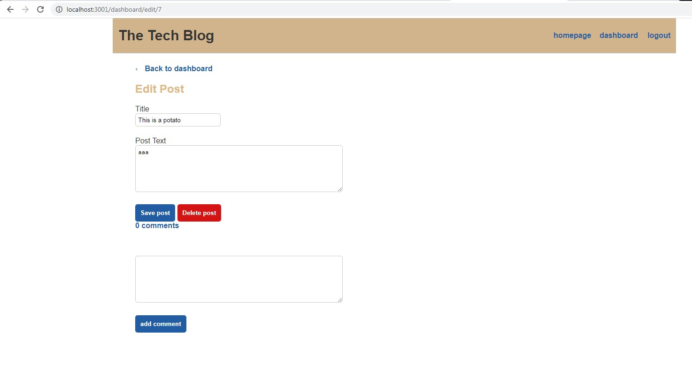

# tech-blog

## Description

This is a simple application to demonstrate understanding of the front and back end of an tech blog. 

## Deployed Application
https://dreadful-skeleton-87144.herokuapp.com/

## Specifications
The first time the user visits the site, they will be presented with the homepage. On the homepage, any existing blog posts will be shown. There will be navigation links at the top of the page for homepage, dashboard, and login.

Clicking on the homepage will redirect back to the homepage. Any other links will take you to a page that has fields for the user to  sign up or sign in. Signing up will redirect the user to their dashboard.

When a user revisits the site, they can use their credentials to login. By being signed in, the user will see navigation links for the homepage, dashboard, and an option to log out.

Clicking on the homepage will take the user to the homepage that will display any existing blog posts with the post title, content, and the date created.

Clicking on a blog post on the homepage will take the user to a page that will show that blog post specifically and also allow for comments to be made if the user is signed in.

Clicking on the dashboard takes the user to a page that displays and posts that they have made and a form to enter a new post. After a new post has been created, the user will be redirected back to their dashboard and it will be displayed there.

Clicking on a post on the dashboard will let the user delete or edit that post.

Clicking on logout, will log the user out.

Being idle on the page for an hour will automatically log the user out.

## Screenshots

## License

This project is covered under a MIT license. Feel free to use it as you wish.

## Questions

  GitHub User Name: willsan0723

  [GitHub Repository](https://github.com/willsan0723/)

  If you have any additional questions you can reach me at william.santee@gmail.com
